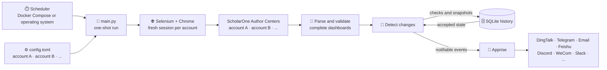

<h1 align="center">Manuscript Monitor</h1>

<p align="center">
  Monitor multiple ScholarOne accounts, preserve submission history, and get notified when a status changes.
</p>

<p align="center">
  <a href="https://github.com/zfb132/manuscript-monitor/actions/workflows/ci.yml"></a>
  <a href="https://www.python.org/downloads/"></a>
  <a href="Dockerfile"></a>
  <a href="LICENSE"></a>
</p>

<p align="center">
  <strong>English</strong> · <a href="README_zh.md">Chinese</a>
</p>

## Overview

Manuscript Monitor signs in to one or more ScholarOne Author Centers during a single run,
reads each manuscript dashboard, stores durable per-account history in SQLite, and sends changes
to any destination supported by
[Apprise](https://appriseit.com/getting-started/universal-syntax/).

The application can be run as a single file: `main.py` performs one complete check and
exits. Run it from your operating system's scheduler, or use Docker Compose for a startup check
followed by recurring checks through Supercronic.

> This is an independent community project and is not affiliated with ScholarOne.

## ✨ Features

- **Automatic monitoring** — signs in with Selenium and reads the ScholarOne author dashboard.
- **Precise change detection** — reports new, changed, disappeared, and reappeared manuscripts.
- **Flexible scope** — monitors every manuscript or only selected manuscript IDs.
- **Multiple ScholarOne accounts** — checks every configured account sequentially while keeping
  configuration, history, and notifications isolated per account.
- **Durable history** — records checks, observations, state changes, and delivery results in SQLite.
- **Universal notifications** — uses Apprise to reach email, chat, push, and many other services.
- **Failure-safe updates** — advances notification-bearing state only after at least one destination
  accepts the message.
- **Two deployment modes** — runs natively on Linux, macOS, and Windows, or in Docker on amd64 and
  arm64.

## 🧩 Architecture



1. Load and reconcile every account from `config.toml`.
2. Check accounts sequentially, using a fresh browser session for each one.
3. Parse and validate every row in the complete manuscript dashboard.
4. Compare each account with its last accepted state in SQLite.
5. Send one ordered notification per account and commit the new state after delivery succeeds.

A missing or malformed dashboard fails the account check. It is never interpreted as an empty
dashboard, so a broken login or a ScholarOne layout change cannot silently mark every manuscript
as disappeared.

## 🚀 Quick start

Clone the repository, then choose the deployment that fits your environment:

```bash
git clone https://github.com/zfb132/manuscript-monitor.git
cd manuscript-monitor
```

| | Docker Compose | Native Python |
| --- | --- | --- |
| Browser and driver | Included | Install Chrome or Chromium |
| Scheduling | Included | Use cron, systemd, launchd, or Task Scheduler |
| Recommended for | Always-on deployment | Local checks and custom automation |

### Docker Compose (recommended)

Docker Engine or Docker Desktop with Compose is required.

```bash
cp .env.example .env
mkdir -p data
```

Edit `config.toml` with your ScholarOne site and account settings, then replace the placeholders in
`.env`:

```dotenv
APP_UID=1000
APP_GID=1000
# https://crontab.cronhub.io/
CRON_SCHEDULE='0 */6 * * *'
TZ='UTC'
IEEE_TAP_SCHOLARONE_USERNAME='replace-me'
IEEE_TAP_SCHOLARONE_PASSWORD='replace-me'
IEEE_TAP_APPRISE_URL='replace-me'
IEEE_IOT_SCHOLARONE_USERNAME='replace-me'
IEEE_IOT_SCHOLARONE_PASSWORD='replace-me'
IEEE_IOT_APPRISE_URL='replace-me'
```

Add matching environment variables to `.env` for every additional account referenced by
`config.toml`.

The published image runs as UID/GID 1000. On Linux, if your user has different IDs, set `APP_UID`
and `APP_GID` to the values reported by `id -u` and `id -g`, then use `docker compose up --build -d`;
these variables affect local builds only.

Run the dockerized service:

```bash
docker compose up -d
docker compose logs -f checker
```

Compose pulls `ghcr.io/zfb132/manuscript-monitor:latest` by default.

The container validates the five-field cron expression, runs one startup check, and then starts the
configured schedule. Every invocation waits for the random delay configured by `jitter_seconds`
before checking. `TZ` controls the schedule timezone; history timestamps remain in UTC.

Useful lifecycle commands:

```bash
docker compose logs --tail=200 checker
docker compose restart checker
docker compose stop checker
docker compose start checker
docker compose down
```

Compose bind-mounts `./data` at `/app/data`. Normal container recreation and
`docker compose down` both preserve the SQLite history.

### Native Python

Native execution requires Python 3.10 or newer and Google Chrome or Chromium. Python 3.14 is the
preferred runtime. When no driver path is configured, Selenium Manager discovers or downloads a
compatible driver; its first run may need network access and a writable cache.

With [uv](https://docs.astral.sh/uv/getting-started/installation/):

```bash
cp .env.example .env
# Edit config.toml and .env before continuing.
uv python install 3.14
uv venv --python 3.14 --no-project
uv pip install --python .venv --upgrade --requirements pyproject.toml
set -a && . ./.env && set +a
uv run --no-project python main.py --config config.toml
```

Dependencies are resolved to their newest compatible releases when they are installed. Native
Python does not load `.env` by itself; source it as above or export every variable referenced by
`config.toml`. In PowerShell, set them with `$env:VARIABLE_NAME = "value"` before running the
command.

<details>
<summary>Install with pip instead</summary>

POSIX shells:

```bash
python3 -m venv .venv
. .venv/bin/activate
python -m pip install --upgrade pip
python -m pip install -r requirements.txt
python main.py --config config.toml
```

Windows PowerShell:

```powershell
py -3.14 -m venv .venv
.\.venv\Scripts\python.exe -m pip install --upgrade pip
.\.venv\Scripts\python.exe -m pip install -r requirements.txt
.\.venv\Scripts\python.exe main.py --config config.toml
```

</details>

## ⚙️ Configuration

`--config` defaults to `./config.toml`. Relative paths inside the file are resolved from the
configuration file's directory, and `~` is expanded. The tracked configuration is ready to use as
a template:

```toml
jitter_seconds = 30

[storage]
database_path = "data/submissions.db"

[browser]
headless = true
element_timeout_seconds = 30
page_load_timeout_seconds = 60
# binary_path = "/optional/path/to/chrome"
# driver_path = "/optional/path/to/chromedriver"

[[accounts]]
name = "primary"
url = "https://mc.manuscriptcentral.com/example"
username = "${PRIMARY_SCHOLARONE_USERNAME}"
password = "${PRIMARY_SCHOLARONE_PASSWORD}"
manuscript_ids = []
apprise_urls = ["${PRIMARY_APPRISE_URL}"]

[[accounts]]
name = "secondary"
url = "https://mc.manuscriptcentral.com/another-journal"
username = "${SECONDARY_SCHOLARONE_USERNAME}"
password = "${SECONDARY_SCHOLARONE_PASSWORD}"
manuscript_ids = ["ABC-123"]
apprise_urls = ["${SECONDARY_APPRISE_URL}"]
```

A single invocation checks all configured accounts in the order shown. Repeat `[[accounts]]` as
needed; every account can use its own site, credentials, manuscript filter, and Apprise
destinations.

| Key | Description |
| --- | --- |
| `jitter_seconds` | Maximum random delay before every check, in seconds. Defaults to `30`; use `0` to disable it. |
| `storage.database_path` | SQLite database path; its parent directory is created automatically. |
| `browser.headless` | Use headless (`true`) or visible (`false`) Chrome. |
| `browser.element_timeout_seconds` | Positive wait time for login and dashboard elements. |
| `browser.page_load_timeout_seconds` | Positive Selenium page-load timeout. |
| `browser.binary_path` | Optional Chrome/Chromium executable; `CHROME_BIN` is the environment fallback. |
| `browser.driver_path` | Optional ChromeDriver executable; `CHROMEDRIVER_PATH` is the environment fallback. |
| `accounts[].name` | Unique, case-sensitive account identity. Keep it stable to preserve history. |
| `accounts[].url` | ScholarOne login URL using HTTP or HTTPS. |
| `accounts[].username` | ScholarOne username; environment references are recommended. |
| `accounts[].password` | ScholarOne password; use an environment reference. |
| `accounts[].manuscript_ids` | `[]` tracks all manuscripts; otherwise only the listed short IDs are in scope. |
| `accounts[].apprise_urls` | One or more unique destinations using [Apprise URL syntax](https://appriseit.com/getting-started/universal-syntax/). |

`${ENV_VAR}` references are expanded recursively in every configuration string and string-list
item. Missing variables and expansion cycles are configuration errors.

Removing an account or manuscript filter closes its active tracking period without deleting
history or sending a disappearance alert. Restoring the same account `name` reuses its identity and
sends a new initial verification. Renaming an account creates a new identity.

## 🔔 Notifications

### Common channels

Apprise supports many notification services. Common choices are listed below; see the
[official service directory](https://appriseit.com/services/) for complete setup instructions and
URL syntax.

| Channel | Common Apprise scheme |
| --- | --- |
| Email | `mailto://`, `mailtos://` |
| DingTalk | `dingtalk://` |
| Feishu / Lark | `feishu://`, `lark://` |
| WeCom Bot | `wecombot://` |
| ServerChan | `schan://` |
| PushPlus | `pushplus://` |
| Bark | `bark://`, `barks://` |
| PushDeer | `pushdeer://`, `pushdeers://` |
| WxPusher | `wxpusher://` |
| Telegram | `tgram://` |
| Discord | `discord://` |
| Slack | `slack://` |
| Microsoft Teams | `workflows://` |
| WhatsApp | `whatsapp://` |
| Matrix | `matrix://`, `matrixs://` |
| ntfy | `ntfy://`, `ntfys://` |
| Gotify | `gotify://`, `gotifys://` |
| Pushover | `pover://` |

Add one or more URLs to each account's `apprise_urls` list. Accounts can use different channels,
and all destinations configured for an account are attempted independently.

### Configuration examples

Keep complete Apprise URLs in environment variables so tokens and passwords do not enter
`config.toml`. Replace every `{...}` placeholder before use:

```dotenv
# .env
PRIMARY_WECOM_URL='wecombot://{bot_key}'
PRIMARY_DINGTALK_URL='dingtalk://{secret}@{token}'
PRIMARY_FEISHU_URL='feishu://{token}'
PRIMARY_TELEGRAM_URL='tgram://{bot_token}/{chat_id}'
PRIMARY_DISCORD_URL='discord://{webhook_id}/{webhook_token}'
PRIMARY_EMAIL_URL='mailtos://{user}:{app_password}@{domain}'
```

Reference any combination of them from an account block:

```toml
# Inside one [[accounts]] block in config.toml
apprise_urls = [
  "${PRIMARY_WECOM_URL}",
  "${PRIMARY_TELEGRAM_URL}",
  "${PRIMARY_EMAIL_URL}",
]
```

### Message examples

An initial verification with one manuscript looks like this:

```text
Submission status verification for primary

Account: primary
Checked at: 2026-09-01T04:00:00Z

Event: CURRENT
ID: AP-2026-001
Title: A Reliable Method for Example Research
Submitted: 01-Sep-2026
Status: Awaiting Administrator Processing
```

A later check for the same account may report a status change for that manuscript:

```text
Submission status changes for primary
Account: primary
Checked at: 2026-09-03T06:00:23Z

Event: STATUS_CHANGED
ID: AP-2026-001
Title: A Reliable Method for Example Research
Submitted: 01-Sep-2026
Previous status: Awaiting TE Recommendation
Current status: Awaiting EIC Decision
```

### Notification rules

| Dashboard change | Event | Notification |
| --- | --- | --- |
| First successful check or account reactivation | `CURRENT` | Yes, including an empty-scope verification |
| After initialization, a manuscript appears for the first time | `NEW` | Yes |
| Status text changes | `STATUS_CHANGED` | Yes, with previous and current status |
| Previously accepted manuscript is absent from a valid dashboard | `DISAPPEARED` | Yes |
| Missing manuscript returns | `REAPPEARED` | Yes |
| Only title or submission date changes | — | Stored without notification |
| Nothing changes | — | No notification |

Events are sorted by manuscript ID and combined into one untruncated message per account. Every
configured destination is attempted independently:

- If at least one destination succeeds, the change is committed; failed sibling destinations are
  not retried.
- If every destination fails, the accepted state does not advance and the complete message is
  regenerated on the next run.
- Delivery is at least once. A crash after an external service accepts a message but before SQLite
  commits it can produce a duplicate later.

Accounts run in configuration order. Failure in one account does not stop later accounts, but the
overall process exits with a failure status.

## ⏱️ Scheduling

`main.py` always performs exactly one check and exits; it does not contain a scheduling loop.
Before each check, it waits for a random duration from zero through `jitter_seconds`.

- **Docker Compose:** set the required `CRON_SCHEDULE` in `.env` using standard five-field cron
  syntax.
- **Native deployment:** schedule the one-shot command with cron, a systemd timer, macOS launchd,
  or Windows Task Scheduler.

Native jobs should use absolute paths, inherit the same environment variables as a successful
manual run, and have network and database-directory access. A non-blocking file lock at
`<database_path>.lock` prevents overlapping checks. After its jitter delay, an invocation exits
with code 1 if another check still holds the lock.

Runtime logs identify each checked account and manuscript, show previous and current statuses,
report notification delivery by destination scheme, and finish with a per-account outcome summary.
Passwords and complete Apprise URLs are not logged.

## 🔐 Data and security

- Native runs store history at `storage.database_path`; the sample path is
  `data/submissions.db`.
- With the sample configuration, Docker Compose stores the same file under the bind-mounted
  `./data` directory.
- SQLite retains account configuration revisions, manuscript metadata, observations, accepted
  state, notification bodies, and redacted delivery results.
- Passwords and complete Apprise URLs are never stored in SQLite, but usernames, journal URLs,
  manuscript details, and notification contents are. The database is not encrypted.
- Stop scheduled and manual checks before backup or restore, and use SQLite's
  [Online Backup API](https://www.sqlite.org/backup.html) rather than copying a live database.
- Always use `docker compose config --quiet`; the non-quiet form can print resolved secrets.

## 🛠️ Troubleshooting

- **Login does not complete:** temporarily set `browser.headless = false` and run one manual check.
  Confirm the URL, credentials, author role, and current ScholarOne layout.
- **Dashboard is missing or malformed:** the account fails safely and accepted state does not
  advance. ScholarOne selector changes may require a code update.
- **Chrome or ChromeDriver cannot start:** make sure their major versions match, configure explicit
  paths, or remove path overrides to return to Selenium Manager.
- **Notifications repeat:** this is expected after total delivery failure because state was not
  committed. Test each Apprise URL separately.
- **Database lock error:** another run is active. Fix overlapping schedules; do not delete the lock
  file while a process is still running.

| Exit code | Meaning |
| --- | --- |
| `0` | Every configured account succeeded; `--help` also exits 0. |
| `1` | An account, notification, browser, parser, database, or process-lock operation failed. |
| `2` | Command-line usage or configuration loading/validation failed. |

## Development

```bash
uv venv --python 3.14 --no-project
uv pip install --python .venv --upgrade --requirements pyproject.toml --group dev
uv run --no-project python -m py_compile main.py
uv run --no-project python -c "import main"
uv run --no-project ruff check main.py
uv run --no-project ruff format --check main.py
```

Issues and pull requests are welcome. Please avoid including credentials, Apprise URLs, or
manuscript data in reports and fixtures.

## License

Distributed under the [GNU General Public License v3.0](LICENSE).
