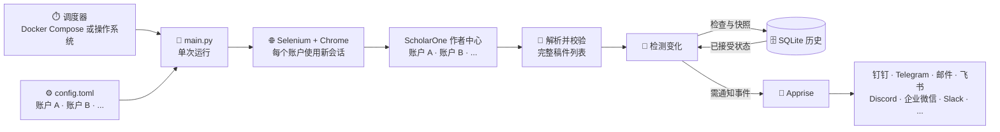

<h1 align="center">Manuscript Monitor</h1>

<p align="center">
  同时监控多个 ScholarOne 账户，持续保存投稿历史，并在状态变化时及时接收通知。
</p>

<p align="center">
  <a href="https://github.com/zfb132/manuscript-monitor/actions/workflows/ci.yml"></a>
  <a href="https://www.python.org/downloads/"></a>
  <a href="Dockerfile"></a>
  <a href="LICENSE"></a>
</p>

<p align="center">
  <a href="README.md">English</a> · <strong>简体中文</strong>
</p>

## 项目简介

Manuscript Monitor 会在单次运行中依次登录一个或多个 ScholarOne 作者中心，读取每个
账户的稿件列表，将各账户历史分别持久化到 SQLite，并通过
[Apprise](https://appriseit.com/getting-started/universal-syntax/) 向任意受支持的目标发送
变更通知。

项目支持单文件运行：`main.py` 每次完成一次检查后退出。你可以交给操作系统的
任务调度器定期执行，也可以使用 Docker Compose 在启动时检查，并通过 Supercronic
继续定时检查。

> 本项目是独立的社区项目，与 ScholarOne 官方无关。

## ✨ 功能亮点

- **自动检查** — 使用 Selenium 登录并读取 ScholarOne 作者控制台。
- **精确识别变更** — 报告新增、状态变化、消失和重新出现的稿件。
- **灵活跟踪范围** — 可监控账户下的全部稿件，也可只监控指定稿件 ID。
- **多个 ScholarOne 账户** — 按配置顺序依次检查所有账户，每个账户的配置、历史和通知
  相互独立。
- **持久历史** — 使用 SQLite 记录检查、观察结果、状态变化和投递结果。
- **多渠道通知** — 通过 Apprise 接入邮件、聊天、推送等多种服务。
- **安全的状态提交** — 至少一个通知目标成功接收消息后，才接受需要通知的状态变化。
- **两种部署方式** — 支持 Linux、macOS、Windows 原生运行，以及 amd64、arm64 Docker
  部署。

## 🧩 架构设计



1. 从 `config.toml` 加载并协调全部账户。
2. 按顺序检查账户，每个账户使用新的浏览器会话。
3. 解析并校验完整稿件控制台中的每一行。
4. 将每个账户与 SQLite 中上一次已接受状态比较。
5. 为每个账户发送一条有序通知，并在投递成功后提交新状态。

控制台缺失或格式异常会使该账户检查失败，绝不会被当作空控制台处理。因此，登录失败或
ScholarOne 页面结构变化不会悄悄把所有稿件标记为消失。

## 🚀 快速开始

先克隆仓库，再根据运行环境选择部署方式：

```bash
git clone https://github.com/zfb132/manuscript-monitor.git
cd manuscript-monitor
```

| | Docker Compose | 原生 Python |
| --- | --- | --- |
| 浏览器与驱动 | 已包含 | 需要安装 Chrome 或 Chromium |
| 定时调度 | 已包含 | 使用 cron、systemd、launchd 或任务计划程序 |
| 适用场景 | 长期后台运行 | 本地检查与自定义自动化 |

### Docker Compose（推荐）

需要安装 Docker Engine 或 Docker Desktop，并启用 Compose。

```bash
cp .env.example .env
mkdir -p data
```

编辑 `config.toml`，填入 ScholarOne 站点和账户设置，然后替换 `.env` 中的占位值：

```dotenv
APP_UID=1000
APP_GID=1000
# https://crontab.cronhub.io/
CRON_SCHEDULE='0 */6 * * *'
TZ='UTC'
IEEE_TAP_SCHOLARONE_USERNAME='replace-me'
IEEE_TAP_SCHOLARONE_PASSWORD='replace-me'
IEEE_TAP_APPRISE_URL='replace-me'
IEEE_IOT_SCHOLARONE_USERNAME='replace-me'
IEEE_IOT_SCHOLARONE_PASSWORD='replace-me'
IEEE_IOT_APPRISE_URL='replace-me'
```

请在 `.env` 中加入 `config.toml` 里每个新增账户所引用的对应环境变量。

发布镜像以 UID/GID 1000 运行。在 Linux 上，如果当前用户的 ID 不同，请将 `APP_UID` 和
`APP_GID` 分别设为 `id -u` 和 `id -g` 的输出，然后使用
`docker compose up --build -d`；这些变量只影响本地构建。

启动服务：

```bash
docker compose up -d
docker compose logs -f checker
```

Compose 默认拉取 `ghcr.io/zfb132/manuscript-monitor:latest`。

容器会验证五字段 cron 表达式，执行一次启动检查，然后启动设定的定时任务。每次调用都会
先按 `jitter_seconds` 设置随机等待，再开始检查。`TZ` 控制调度时区；历史记录的时间戳
始终使用 UTC。

常用生命周期命令：

```bash
docker compose logs --tail=200 checker
docker compose restart checker
docker compose stop checker
docker compose start checker
docker compose down
```

Compose 会将 `./data` 绑定挂载到 `/app/data`。正常重建容器和运行
`docker compose down` 都会保留 SQLite 历史。

### 原生 Python

原生运行需要 Python 3.10 或更高版本，以及 Google Chrome 或 Chromium；推荐使用
Python 3.14。未配置驱动路径时，Selenium Manager 会查找或下载兼容驱动，首次运行可能
需要网络访问和可写缓存。

使用 [uv](https://docs.astral.sh/uv/getting-started/installation/)：

```bash
cp .env.example .env
# 继续前请先编辑 config.toml 和 .env。
uv python install 3.14
uv venv --python 3.14 --no-project
uv pip install --python .venv --upgrade --requirements pyproject.toml
set -a && . ./.env && set +a
uv run --no-project python main.py --config config.toml
```

安装时会把依赖解析为最新的兼容版本。原生 Python 不会自动加载 `.env`；请像上面一样导入
它，或导出 `config.toml` 引用的全部变量。在 PowerShell 中，可先通过
`$env:VARIABLE_NAME = "value"` 设置变量。

<details>
<summary>改用 pip 安装</summary>

POSIX shell：

```bash
python3 -m venv .venv
. .venv/bin/activate
python -m pip install --upgrade pip
python -m pip install -r requirements.txt
python main.py --config config.toml
```

Windows PowerShell：

```powershell
py -3.14 -m venv .venv
.\.venv\Scripts\python.exe -m pip install --upgrade pip
.\.venv\Scripts\python.exe -m pip install -r requirements.txt
.\.venv\Scripts\python.exe main.py --config config.toml
```

</details>

## ⚙️ 配置说明

`--config` 默认读取 `./config.toml`。配置中的相对路径以配置文件所在目录为基准，并支持
展开 `~`。仓库中的配置文件可直接作为模板：

```toml
jitter_seconds = 30

[storage]
database_path = "data/submissions.db"

[browser]
headless = true
element_timeout_seconds = 30
page_load_timeout_seconds = 60
# binary_path = "/optional/path/to/chrome"
# driver_path = "/optional/path/to/chromedriver"

[[accounts]]
name = "primary"
url = "https://mc.manuscriptcentral.com/example"
username = "${PRIMARY_SCHOLARONE_USERNAME}"
password = "${PRIMARY_SCHOLARONE_PASSWORD}"
manuscript_ids = []
apprise_urls = ["${PRIMARY_APPRISE_URL}"]

[[accounts]]
name = "secondary"
url = "https://mc.manuscriptcentral.com/another-journal"
username = "${SECONDARY_SCHOLARONE_USERNAME}"
password = "${SECONDARY_SCHOLARONE_PASSWORD}"
manuscript_ids = ["ABC-123"]
apprise_urls = ["${SECONDARY_APPRISE_URL}"]
```

单次运行会按显示顺序检查全部账户。可按需重复添加 `[[accounts]]`；每个账户都能分别设置
站点、凭据、稿件过滤条件和 Apprise 通知目标。

| 配置项 | 说明 |
| --- | --- |
| `jitter_seconds` | 每次检查前随机等待的最大秒数；默认 `30`，设为 `0` 可关闭。 |
| `storage.database_path` | SQLite 数据库路径；程序会自动创建父目录。 |
| `browser.headless` | 使用无头（`true`）或可见（`false`）Chrome。 |
| `browser.element_timeout_seconds` | 等待登录和控制台元素的正数秒数。 |
| `browser.page_load_timeout_seconds` | Selenium 页面加载的正数超时秒数。 |
| `browser.binary_path` | 可选的 Chrome/Chromium 路径；环境变量后备项为 `CHROME_BIN`。 |
| `browser.driver_path` | 可选的 ChromeDriver 路径；环境变量后备项为 `CHROMEDRIVER_PATH`。 |
| `accounts[].name` | 唯一且区分大小写的账户身份；保持稳定才能延续历史。 |
| `accounts[].url` | 使用 HTTP 或 HTTPS 的 ScholarOne 登录地址。 |
| `accounts[].username` | ScholarOne 用户名；建议引用环境变量。 |
| `accounts[].password` | ScholarOne 密码；应引用环境变量。 |
| `accounts[].manuscript_ids` | `[]` 表示全部稿件；否则只跟踪列出的短稿件 ID。 |
| `accounts[].apprise_urls` | 一个或多个不重复的目标，使用 [Apprise URL 语法](https://appriseit.com/getting-started/universal-syntax/)。 |

每个配置字符串和字符串列表元素中的 `${ENV_VAR}` 都会递归展开。变量缺失或出现展开循环
均属于配置错误。

移除账户或稿件过滤条件只会关闭其活动跟踪周期，不会删除历史或发送消失通知。恢复相同
账户 `name` 会沿用原身份，并重新发送首次验证；修改账户名称则会创建新身份。

## 🔔 通知

### 常见渠道

Apprise 支持大量通知服务。以下列出一些常用选项；完整配置步骤和 URL 语法请查看
[Apprise 官方服务目录](https://appriseit.com/services/)。

| 渠道 | 常用 Apprise scheme |
| --- | --- |
| 邮件 | `mailto://`、`mailtos://` |
| 钉钉 | `dingtalk://` |
| 飞书 / Lark | `feishu://`、`lark://` |
| 企业微信机器人 | `wecombot://` |
| Server 酱（ServerChan） | `schan://` |
| PushPlus | `pushplus://` |
| Bark | `bark://`、`barks://` |
| PushDeer | `pushdeer://`、`pushdeers://` |
| WxPusher | `wxpusher://` |
| Telegram | `tgram://` |
| Discord | `discord://` |
| Slack | `slack://` |
| Microsoft Teams | `workflows://` |
| WhatsApp | `whatsapp://` |
| Matrix | `matrix://`、`matrixs://` |
| ntfy | `ntfy://`、`ntfys://` |
| Gotify | `gotify://`、`gotifys://` |
| Pushover | `pover://` |

在每个账户的 `apprise_urls` 列表中添加一个或多个 URL。不同账户可以使用不同渠道；程序会
独立尝试一个账户下配置的全部通知目标。

### 配置示例

建议将完整 Apprise URL 保存在环境变量中，避免令牌和密码进入 `config.toml`。使用前必须
替换每一个 `{...}` 占位符：

```dotenv
# .env
PRIMARY_WECOM_URL='wecombot://{bot_key}'
PRIMARY_DINGTALK_URL='dingtalk://{secret}@{token}'
PRIMARY_FEISHU_URL='feishu://{token}'
PRIMARY_TELEGRAM_URL='tgram://{bot_token}/{chat_id}'
PRIMARY_DISCORD_URL='discord://{webhook_id}/{webhook_token}'
PRIMARY_EMAIL_URL='mailtos://{user}:{app_password}@{domain}'
```

在账户配置块中引用任意组合：

```toml
# 添加到 config.toml 的某个 [[accounts]] 块中
apprise_urls = [
  "${PRIMARY_WECOM_URL}",
  "${PRIMARY_TELEGRAM_URL}",
  "${PRIMARY_EMAIL_URL}",
]
```

### 消息示例

包含一篇稿件的首次验证示例如下：

```text
Submission status verification for primary

Account: primary
Checked at: 2026-09-01T04:00:00Z

Event: CURRENT
ID: AP-2026-001
Title: A Reliable Method for Example Research
Submitted: 01-Sep-2026
Status: Awaiting Administrator Processing
```

后续同一账户的检查可能报告该稿件的状态变化：

```text
Submission status changes for primary
Account: primary
Checked at: 2026-09-03T06:00:23Z

Event: STATUS_CHANGED
ID: AP-2026-001
Title: A Reliable Method for Example Research
Submitted: 01-Sep-2026
Previous status: Awaiting TE Recommendation
Current status: Awaiting EIC Decision
```

### 通知规则

| 控制台变化 | 事件 | 是否通知 |
| --- | --- | --- |
| 首次成功检查或账户重新启用 | `CURRENT` | 是；跟踪范围为空时也会发送验证 |
| 初始化后，稿件首次出现 | `NEW` | 是 |
| 状态文本变化 | `STATUS_CHANGED` | 是；包含新旧状态 |
| 之前已接受的稿件从有效控制台中消失 | `DISAPPEARED` | 是 |
| 已消失稿件重新出现 | `REAPPEARED` | 是 |
| 只有标题或投稿日期变化 | — | 仅保存，不通知 |
| 没有变化 | — | 不通知 |

同一账户的事件会按稿件 ID 排序，并合并为一条不截断的消息。每个通知目标都会独立尝试：

- 至少一个目标成功时提交变更；同一批次中失败的其他目标不会重试。
- 所有目标都失败时，已接受状态不会前进，下次运行会重新生成完整消息。
- 投递语义为至少一次。如果外部服务接收消息后、SQLite 提交前进程崩溃，后续可能产生
  重复通知。

账户按配置顺序执行。一个账户失败不会阻止后续账户，但整个进程会返回失败状态。

## ⏱️ 定时运行

`main.py` 每次始终只执行一次检查后退出，不包含内部调度循环。
每次检查前，程序会在零到 `jitter_seconds` 秒之间随机等待。

- **Docker Compose：** 在 `.env` 中通过标准五字段 cron 语法设置必填的
  `CRON_SCHEDULE`。
- **原生部署：** 使用 cron、systemd timer、macOS launchd 或 Windows 任务计划程序
  调用单次运行命令。

原生任务应使用绝对路径，继承与成功手动运行相同的环境变量，并拥有网络和数据库目录访问
权限。程序会在整个运行期间持有非阻塞的 `<database_path>.lock` 文件锁；随机等待结束后，
若另一个检查仍持有该锁，本次调用会以代码 1 退出。

运行日志会列出所检查的账户和稿件，显示之前与当前状态、各通知协议的投递结果，以及最终
的账户成功/失败汇总；不会输出密码或完整的 Apprise URL。

## 🔐 数据与安全

- 原生运行将历史保存在 `storage.database_path`，示例路径为
  `data/submissions.db`。
- 使用示例配置时，Docker Compose 将相同文件保存在绑定挂载的 `./data` 目录中。
- SQLite 会记录账户配置版本、稿件元数据、观察结果、已接受状态、通知正文和脱敏后的投递
  结果。
- SQLite 绝不会保存密码或完整 Apprise URL，但会保存用户名、期刊网址、稿件详情和通知
  内容；数据库本身没有加密。
- 备份或恢复前应停止全部计划任务和手动检查，并使用 SQLite
  [在线备份 API](https://www.sqlite.org/backup.html)，不要直接复制正在使用的数据库。
- 始终使用 `docker compose config --quiet`；非静默形式可能输出解析后的秘密。

## 🛠️ 故障排查

- **无法完成登录：** 暂时设置 `browser.headless = false` 并手动运行一次。检查网址、凭据、
  作者角色和当前 ScholarOne 页面结构。
- **控制台缺失或格式异常：** 该账户会安全失败，已接受状态不会前进。ScholarOne 选择器
  发生变化时可能需要更新代码。
- **Chrome 或 ChromeDriver 无法启动：** 确保二者主版本一致；配置明确路径，或删除路径
  覆盖以恢复使用 Selenium Manager。
- **通知重复：** 所有目标投递失败后状态不会提交，因此重复属于预期行为。请分别测试每个
  Apprise URL。
- **数据库锁错误：** 另一个检查仍在运行。应修正重叠调度，不要在进程仍运行时删除锁文件。

| 退出代码 | 含义 |
| --- | --- |
| `0` | 所有已配置账户成功；`--help` 也返回 0。 |
| `1` | 账户、通知、浏览器、解析器、数据库或进程锁操作失败。 |
| `2` | 命令行用法或配置加载、校验失败。 |

## 开发

```bash
uv venv --python 3.14 --no-project
uv pip install --python .venv --upgrade --requirements pyproject.toml --group dev
uv run --no-project python -m py_compile main.py
uv run --no-project python -c "import main"
uv run --no-project ruff check main.py
uv run --no-project ruff format --check main.py
```

欢迎提交 Issue 和 Pull Request。请勿在问题报告或测试夹具中包含凭据、Apprise URL 或稿件
数据。

## 许可证

本项目基于 [GNU General Public License v3.0](LICENSE) 发布。
